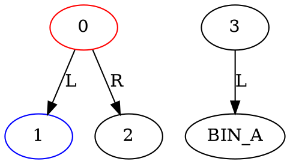

# Chromatic Sorting Matrix Simulation

Analyze the image `/task/sorting_network.png` and produce two output files.

## Image Contents

The image shows a sorting network with:
- **6 numbered nodes (0–5)**, each colored RED, BLUE, or GREEN
- Each node shows a diverter arrow labeled `→L` (routes left) or `→R` (routes right)
- **Edges** labeled `L` or `R` show which child each direction leads to
- **4 bins** at the bottom: BIN_A, BIN_B, BIN_C, BIN_D
- **Incoming queue** at top: 10 packages labeled #1–#10 with colors
  - Package #1 drops first into Node 0

## Routing Rules

1. A package at a node routes to the child indicated by the node's **current** arrow (L or R)
2. **After routing**: if the package color **matches** the node color → **flip** the arrow (L↔R)
3. If colors don't match → arrow stays unchanged

## Output Files

Write both files to `/task/`:

**`/task/topology.dot`** — initial state before any packages drop:


**`/task/trace.csv`** — one row per package:
```csv
package_id,package_color,route,final_bin
1,RED,0->2->5,BIN_D
```

Route format: `0->1->4` (node IDs separated by `->`, ending at a node before the bin)

## Scoring

- Topology node colors + arrows: 30pts
- Topology edges: 30pts  
- Trace final_bin per package: 30pts
- Trace route per package: 10pts
